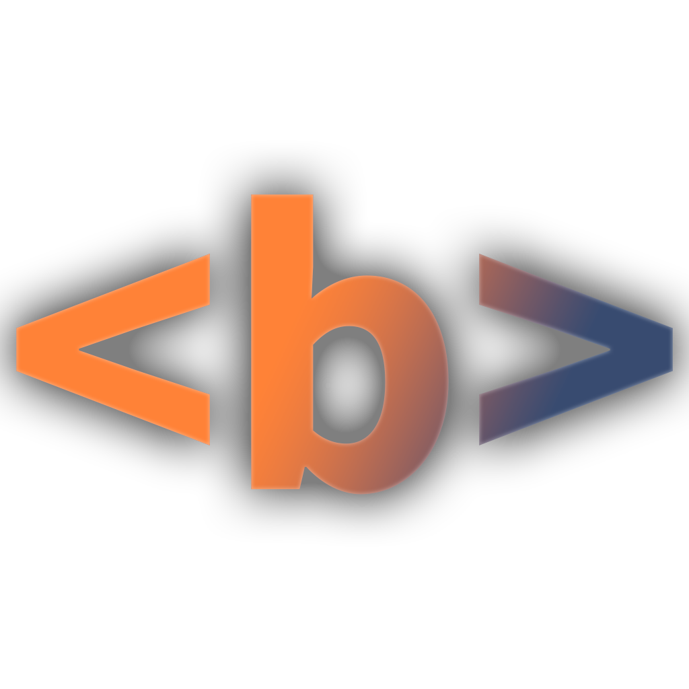

 

# Half-Bold Reader

[Report a Bug][report-bug-link] · [Request a Feature][enhancement-link]

[![][edge-addon-users-shield]][edge-addon-link]
[![][edge-addon-rating-shield]][edge-addon-link] 

[![][edge-addon-version-shield]][edge-addon-link]
[![][latest-release-shield]][latest-release-link] 

[![][github-stars-shield]][github-stars-link]
[![][github-license-shield]][github-license-link] 

## About the half-bold reader

Half-Bold Reader is a tool to make any selected page more quickly readable.

All text is formatted to have the first half of each word in bold. This formatting can help some people skim texts more quickly while retaining just as much information.

To apply the formatting to a desired page, simply go to the page and click the addon icon... it's that simple!

## Get Half-Bold Reader

The addon is currently available through Microsoft Edge Addons and through manual installation.

### Microsoft Edge

Installation for Edge is quite simple through the addon store:

  
  [![][edge-addon-shield]][edge-addon-link]
  

### Manual Installation

The manual installation is slightly more involved, however it allows the addon to work in other browsers (such as Chrome).

Download the [latest release build][latest-release-link] and unzip it, enable developer mode in the extensions tab, then load it as an unpacked extension by selecting the unzipped folder.

> \[!WARNING]
> Note that manual installation is less secure as it requires developper mode to be enabled for the extension to work.

## License
Licensed under [GNU GPLv2][github-license-link].

  
  [![][back-to-top]](#readme-top)

<!-- Link Group -->

[back-to-top]: https://img.shields.io/badge/BACK%20TO%20TOP-101010?style=flat-square
[report-bug-link]: https://github.com/DarkMattrMaestro/half-bold-reader/issues/new?labels=bug
[enhancement-link]: https://github.com/DarkMattrMaestro/half-bold-reader/issues/new?labels=enhancement

<!-- Shield Group -->

[latest-release-shield]: https://img.shields.io/github/v/release/DarkMattrMaestro/half-bold-reader?style=flat
[latest-release-link]: https://github.com/DarkMattrMaestro/half-bold-reader/releases

[edge-addon-version-shield]: https://img.shields.io/badge/dynamic/json?label=edge%20add-on&prefix=v&query=%24.version&url=https%3A%2F%2Fmicrosoftedge.microsoft.com%2Faddons%2Fgetproductdetailsbycrxid%2Fipfflipmhjogdibdefenldjfdjpjefjp
[edge-addon-rating-shield]: https://img.shields.io/badge/dynamic/json?label=rating&suffix=/5&query=%24.averageRating&url=https%3A%2F%2Fmicrosoftedge.microsoft.com%2Faddons%2Fgetproductdetailsbycrxid%2Fipfflipmhjogdibdefenldjfdjpjefjp
[edge-addon-users-shield]: https://img.shields.io/badge/dynamic/json?label=users&query=%24.activeInstallCount&url=https%3A%2F%2Fmicrosoftedge.microsoft.com%2Faddons%2Fgetproductdetailsbycrxid%2Fipfflipmhjogdibdefenldjfdjpjefjp
[edge-addon-shield]: https://img.shields.io/badge/Edge%20addon-blue?style=plastic
[edge-addon-link]: https://microsoftedge.microsoft.com/addons/detail/halfbold-reader/ipfflipmhjogdibdefenldjfdjpjefjp

[github-stars-shield]: https://img.shields.io/github/stars/DarkMattrMaestro/half-bold-reader?style=flat
[github-stars-link]: https://github.com//DarkMattrMaestro/half-bold-reader/stargazers

[github-license-shield]: https://img.shields.io/github/license/DarkMattrMaestro/half-bold-reader
[github-license-link]: https://github.com/DarkMattrMaestro/half-bold-reader/blob/main/LICENSE.md
